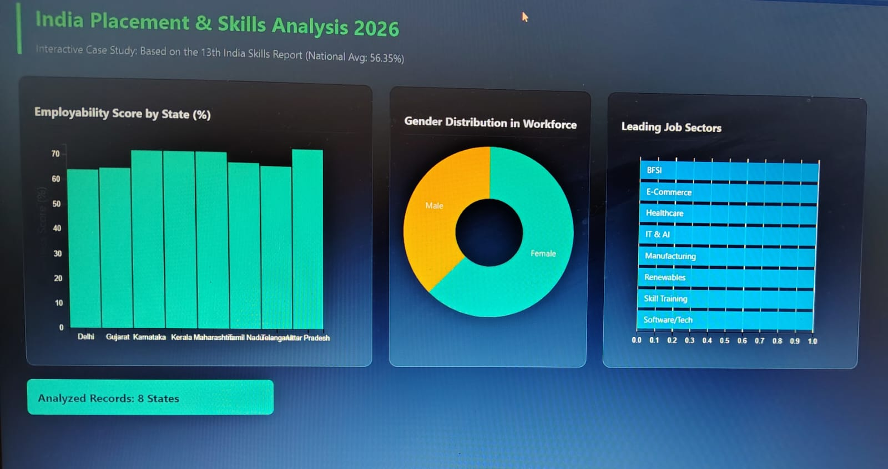

# 🇮🇳 India Placement & Skills Analysis 2026

## 📊 Project Overview
This project is an interactive data visualization dashboard that analyzes employability, workforce distribution, and job sectors across Indian states based on the India Skills Report 2026.

## 🚀 Features
- 📍 State-wise Employability Score visualization
- 👨‍💼 Gender distribution analysis
- 🏢 Sector-wise job trends
- 🔄 Interactive filtering using DC.js

## 🛠️ Technologies Used
- HTML, CSS, JavaScript
- D3.js
- DC.js
- Crossfilter.js

## 📈 Data Source
India Skills Report 2026 (Sample dataset used for visualization)

## 🌐 Live Demo
https://rudrakotasuchi-maker.github.io/placement-dashbooard/

## 📷 Screenshot

## 📌 How to Run
1. Download the project
2. Open `index.html` in browser

## 👩‍💻 Author
Your Name

## ⭐ Future Improvements
- Add real-time dataset
- Integrate Machine Learning predictions
- Deploy as full web app
